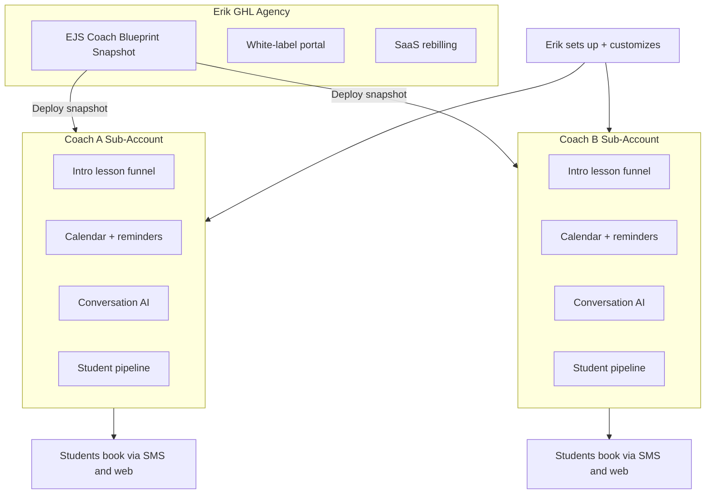

# EJS Coach Blueprint — GHL Agency Package

> **Primary platform.** All scheduling, AI, marketing, SEO, ads, and billing run through GoHighLevel sub-accounts under Erik's agency.

**Start with:** [ghl-master-guide.md](ghl-master-guide.md)

**"I set you up on my system. You teach golf. AI handles scheduling, follow-up, reviews, ads, and marketing."**

Each coach gets their own GHL sub-account under Erik's agency — pre-loaded with funnels, workflows, calendars, and AI from Erik's proven Scottsdale playbook.

---

## Architecture

**What coaches see:** A simple branded login (optional — many never log in). SMS and email do the work.

**What Erik controls:** Agency dashboard, snapshot updates, onboarding, ads, and strategy.

---

## Package tiers (sell to coaches)

| Tier | Coach pays | What they get |
|------|------------|---------------|
| **Front Desk** | $197/mo | Sub-account, intro funnel, calendar, SMS reminders, missed-call text-back, review requests, basic AI replies |
| **Growth** | $397/mo | Front Desk + local SEO website pages, social planner (4 posts/mo templates), nurture sequences, reputation dashboard |
| **Autopilot** | $597/mo | Growth + Meta/Google lead ads managed by Erik, monthly report call, content approval via SMS |
| **Setup** | $997 one-time | White-glove onboarding: photos, copy, calendar, Stripe, GBP connection, first ad campaign |

*Erik's GHL agency cost: ~$497/mo (Agency Pro) + usage. Margin improves with scale via SaaS rebilling.*

---

## Differentiation vs CoachSync / TheGolfStack / DIY GHL

| | CoachSync | TheGolfStack | Generic GHL snapshot | **EJS Blueprint** |
|--|-----------|--------------|----------------------|-------------------|
| Golf-specific playbook | Partial | Templates | No | **Erik's intro funnel, leagues, online upsell** |
| US PGA network credibility | UK | US | None | **Erik's brand + case study** |
| Done-for-you setup | Partial | Self-serve | DIY or freelancer | **Erik sets up every coach** |
| Lives under one agency | No | No | No | **Yes — you own the relationship** |
| AI front desk | WhatsApp | No | Add-on | **SMS + Conversation AI pre-configured** |
| Ads included | No | DIY | DIY | **Managed tier with golf ad templates** |

---

## What stays the same vs custom per coach

### Same for every coach (snapshot)

- Pipeline stages and automations
- Intro lesson funnel structure
- Email/SMS templates (merge fields for name, city, venue)
- Workflow logic (reminders, reviews, nurture timing)
- Conversation AI intent training (booking, pricing, hours)
- Tag taxonomy (`intro-booked`, `package-buyer`, `needs-rebook`, etc.)

### Customized per coach (onboarding — ~2–3 hours)

- Coach name, photo, bio, credentials
- City, venue(s), service area
- Lesson types and pricing
- Calendar availability blocks
- Stripe/payment connection
- Google Business Profile link
- Brand colors on funnel/website
- Ad geo-targeting and budget

---

## Coach experience (designed for 50+ coaches)

1. **Sign up** — Erik sends agreement + setup form (15 min form, not a tech project)
2. **Setup call** — 60 min; Erik or VA wires everything
3. **Go live** — Booking link + phone number active within 48 hours
4. **Daily life** — Students text; AI + workflows respond. Coach gets SMS summaries: *"3 new intro bookings this week."*
5. **Optional login** — Calendar and conversation inbox if they want it; not required

---

## Revenue model for Erik

| Stream | Notes |
|--------|-------|
| Monthly SaaS fee | $197–597/coach; target 20 coaches = $4K–12K MRR |
| Setup fee | $997 × new coaches |
| Ad management margin | 15–20% of ad spend on Autopilot tier |
| Usage rebilling | SMS, AI minutes, email — pass-through + markup via GHL SaaS mode |
| Upsells | League funnel add-on, online lesson funnel, premium website |

---

## Integration with coach's existing tools

Do **not** force coaches off CoachNow/V1 for swing video. This package owns **business operations**:

| Keep | Replace with GHL |
|------|------------------|
| CoachNow / V1 (lesson video) | Calendly, Acuity, manual texting |
| TrackMan / launch monitor | Mailchimp, Constant Contact |
| Venue bay booking (ProAgenda etc.) | Separate website builder, Wix |
| | Google Sheets student tracking |

Optional: read-only calendar sync if venue owns bay scheduling.

---

## Launch sequence

1. **Week 1–2:** Build master sub-account + export snapshot v1
2. **Week 3:** Migrate ejsgolf.com lead flow into Erik's template sub-account (dogfood)
3. **Week 4–6:** Onboard 3 beta coaches (discounted, case studies)
4. **Week 7+:** Proponent Group / PGA outreach, raise to full pricing

---

## Open decisions

- [ ] White-label domain: `app.ejsgolf.com` vs separate brand (`coachblueprint.com`)
- [ ] GHL plan: Agency Pro ($497) for SaaS mode + snapshots API
- [ ] Who runs setup calls: Erik only vs trained VA with SOP
- [ ] Conversation AI vs third-party (many agencies use GHL native Conversation AI first)
